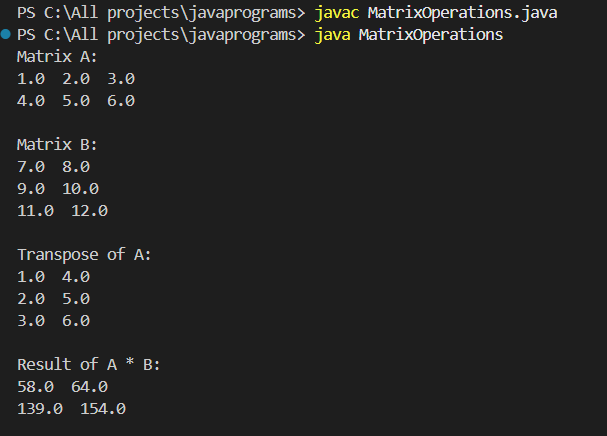
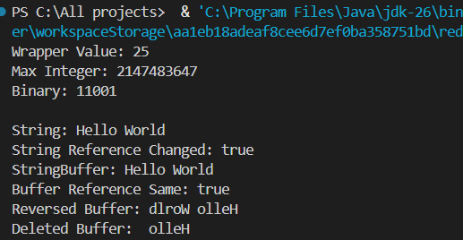
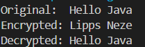
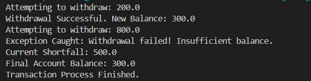

# 💻 Java Programming Assignment

  <b>📘 Programming with Java</b> 
  <i>Complete Practical Implementation Repository</i>

  
  
  

---

## 👨‍🎓 Student Details
| Field | Details |
|------|--------|
| 👤 Name | Om H Machhi |
| 🆔 Enrollment No | 12502080603013 |
| 🎓 Semester | 4th |
| 📅 Academic Year | 2025-26 |

---

## 📑 Assignment Overview
This repository showcases **complete Java practical work**, covering:

✨ Arrays & Strings  
✨ Object-Oriented Programming (OOP)  
✨ Constructors & Inheritance  
✨ Abstract Classes & Polymorphism  
✨ Exception Handling  
✨ Inner Classes  

---

# 📘 Assignment – 1

---

## 🔹 Program 1: Array and String Operations
📌 *Features:* Reverse • Sort • Search • Average • Maximum  

  

---

## 🔹 Program 2: Matrix Operations
📌 *Features:* Constructors • Transpose • Multiplication  

  

---

## 🔹 Program 3: Wrapper Classes & StringBuffer
📌 *Concepts:* Wrapper Classes • String vs StringBuffer  

  

---

## 🔹 Program 4: Bank Account System
📌 *Operations:* Deposit • Withdraw • Balance Inquiry  

  

---

## 🔹 Program 5: Cricket Match System
📌 *Concepts:* Inheritance • Command Line Arguments  

  

---

## 🔹 Program 6: Cipher System
📌 *Concepts:* Abstract Class • Method Overriding  

  

---

## 🔹 Program 7: Inner Classes
📌 *Types:* Member • Local • Anonymous  

  

---

## 🔹 Program 8: Custom Exception Handling
📌 *Concepts:* User-defined Exception • Banking Scenario  

  

---

# 📁 Repository Structure
